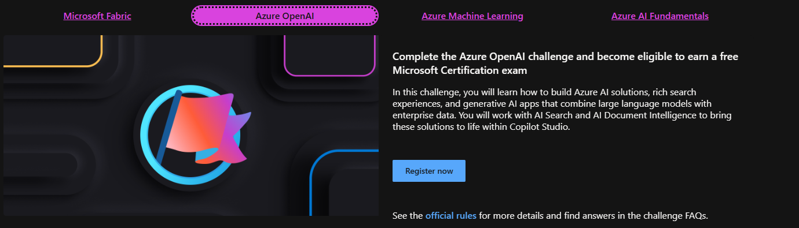

# Azure AI Skill Challenge 2024

## David Cobb, Azure MCT

---

# Intro

<button onclick="document.querySelectorAll('section').forEach((e) => e.classList.toggle('invert'))">Toggle appearance</button>

---

# About Dave

- 30 years (!?) in I.T., starting with phone helpdesk, then roles including web dev, data analyst, & system administrator.
- Currently teach Azure certification as a freelancer 2-3 weeks/month, plus Azure consulting
- Continuous learner and always seeking to expand my knowledge in new technologies like AI

---

# Goals for Talk

- Overview of the Azure AI Skills Challenge
**AND** AI Learning Hub 
- Show you steps for your customized AI learning path
- Help you get started by plugging into community

---

## AI Skills Challenge

- https://www.microsoft.com/en-us/cloudskillschallenge/ai/registration/2024

- 

---

# How does AI fit into your career?

https://aka.ms/AILearningJourneyPoster

---

# Study in Community!

[Microsoft Learn Community](https://learn.microsoft.com/en-us/training/learn-community)

PROTIP: Dive into the [Microsoft Learning Rooms](https://techcommunity.microsoft.com/t5/custom/page/page-id/learn)

Find a study group for a an awesome cert, like AI-102

---

# Choose the right challenge level for you right now
- https://twitter.com/dave000777/status/1715546218930069928

---

# Calls to Action 

- Consider how AI fits into your career
- Choose a AI Skill Challenge and work toward your learning goals (AI-900, AI-102, DP-100,DP-600)
- Join the [MS Learning Rooms](https://techcommunity.microsoft.com/t5/custom/page/page-id/learn)
- Plug into the South Florida community
  - But where???
  
---

# 🌴 South Florida Community Awesomeness 🌴

- [Grammer Hub](https://grammerhub.org)
- [South Florida Tech Hub](https://techhubsouthflorida.org/meetups/)
- [South Florida SQL Server User Group](https://www.meetup.com/sfssug/) 
- [South Florida Data Geeks](https://www.meetup.com/soflodatageeks/)
- [FloridaJS](https://www.meetup.com/floridajs/)
- Other groups to come...

### Not in South Florida? 🌴 Find an [Azure Meetup near you](https://www.meetup.com/topics/azure/)

---
# That's a Wrap

I hope I provided a useful introduction to the Azure AI Skills Challenge and the AI Learning Hub.

# Questions?

- **Watch for discord post on Azure AI Skills Challenge Office Hours**

- https://linkedin.com/in/davidcobb

---

Thank You!

---